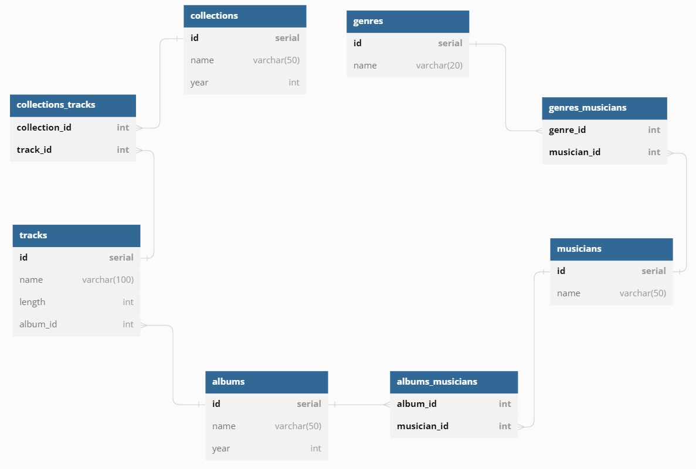

# alchemy queries example

(Python, [SQLAlchemy](https://www.sqlalchemy.org/), [SQLite](https://sqlite.org/index.html))

По мотивам статьи @Yuribtr - [Немного SQL алхимии](https://habr.com/ru/post/531472/)

Cоздается БД и заполняется синтезированными данными.

Выводятся ответы на 15 запросов:

- название и год выхода альбомов, вышедших в 2010 году;
- название и продолжительность самого длительного трека;
- название треков, продолжительность которых не менее 3,5 минуты;
- названия сборников, вышедших в период с 2011 по 2015 год включительно;
- исполнители, чье имя состоит из 1 слова;
- название треков, которые содержат слово «me»;
- количество исполнителей в каждом жанре;
- количество треков, вошедших в альбомы 2009-2011 годов;
- средняя продолжительность треков по каждому альбому;
- все исполнители, которые не выпустили альбомы в 2010 году;
- названия сборников, в которых присутствует конкретный исполнитель; 
- название альбомов, в которых присутствуют исполнители более 1 жанра;
- наименование треков, которые не входят в сборники;
- исполнителей, написавших самый короткий по продолжительности трек;
- название альбомов, содержащих наименьшее количество треков.

Структура БД:

